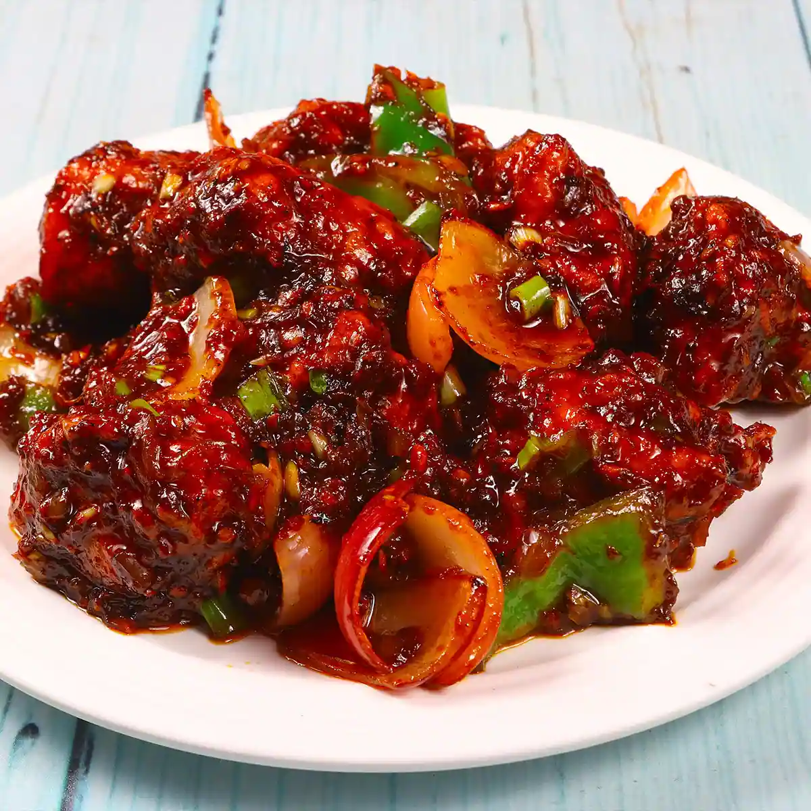

# Ex.07 Restaurant Website
## Date:

## AIM:
To develop a static Restaurant website to display the food items and services provided by them.

## DESIGN STEPS:

### Step 1:
Requirement collection.

### Step 2:
Creating the layout using HTML and CSS.

### Step 3:
Updating the sample content.

### Step 4:
Choose the appropriate style and color scheme.

### Step 5:
Validate the layout in various browsers.

### Step 6:
Validate the HTML code.

### Step 7:
Publish the website in the given URL.

## PROGRAM:
rest.html
```
<!DOCTYPE html>
<html lang="en">
<head>
    <meta charset="UTF-8">
    <meta name="viewport" content="width=device-width, initial-scale=1.0">
    <title>Welcome to Our Restaurant</title>
    <style>

        body {
            margin: 0;
            font-family: 'Arial', sans-serif;
            background-color:rgb(10, 118, 154)
        }

     
        nav {
            display: flex;
            justify-content: space-between;
            align-items: center;
            background-color: #333;
            padding: 10px 20px;
        }

        nav a {
            color: white;
            text-decoration: none;
            margin: 0 15px;
            font-size: 1.1em;
        }

        nav a:hover {
            color: #f39c12;
        }

        .banner {
            height: 100vh;
            background: url('banner2.jpg') no-repeat center center/cover;
            color: white;
            display: flex;
            flex-direction: column;
            justify-content: center;
            align-items: center;
            text-align: center;
            padding: 20px;
        }

        .banner h1 {
            font-size: 4em;
            margin: 0;
            text-shadow: 2px 2px 5px rgba(0, 0, 0, 0.7);
        }

        .banner p {
            font-size: 1.5em;
            margin: 20px 0;
            max-width: 600px;
            line-height: 1.5;
        }

        .banner a {
            padding: 15px 30px;
            background-color: #f39c12;
            color: white;
            font-size: 1.2em;
            text-decoration: none;
            border-radius: 5px;
            transition: background-color 0.3s;
        }

        .banner a:hover {
            background-color: #d35400;
        }

        footer {
            background-color: #333;
            color: white;
            text-align: center;
            padding: 15px;
            font-size: 1em;
        }
    </style>
</head>
<body>

  
    <nav>
        <div>
            <a href="home.html">Home</a>
            <a href="menu.html">Menu</a>
            <a href="contact.html">Contact Us</a>
        </div>
    </nav>

   
    <div class="banner">
         
        <h1>MR Kitchen</h1>
        <p>
            Discover the finest dining experience with exquisite flavors, exceptional service, 
            and a warm atmosphere that will leave you wanting more.
        </p>
    </div>        

    <footer>
        <p>Designed by YUVARAJ M &copy; 2025</p>
    </footer>

</body>
</html>

```
menu.html
```
<!DOCTYPE html>
<html>
<head>
    <title>Restaurant Menu</title>
    <style>
        /* General Styles */
        body {
            font-family: Arial, sans-serif;
            margin: 0;
            padding: 0;
            background-color: #f4f4f4;
        }

        header {
            background-color:dimgray;
            color: white;
            text-align: center;
            padding: 40px;
        }

        header h1 {
            margin: 0;
            font-size: 2.5em;
        }

        header p {
            margin: 10px 0;
            font-size: 1.2em;
        }

        .container {
            max-width: 1200px;
            margin: 20px auto;
            padding: 20px;
        }

        .menu-grid {
            display: grid;
            grid-template-columns: repeat(auto-fit, minmax(250px, 1fr));
            gap: 20px;
        }

        .menu-item {
            background-color: white;
            border-radius: 8px;
            box-shadow: 0 4px 8px rgba(0, 0, 0, 0.1);
            overflow: hidden;
            transition: transform 0.3s, box-shadow 0.3s;
        }

        .menu-item:hover {
            transform: scale(1.05);
            box-shadow: 0 6px 12px rgba(0, 0, 0, 0.2);
        }

        .menu-item img {
            width: 100%;
            height: 200px;
            object-fit: cover;
        }

        .menu-item-content {
            padding: 15px;
            text-align: center;
        }

        .menu-item-content h3 {
            margin: 10px 0;
            font-size: 1.5em;
            color: #333;
        }

        .menu-item-content p {
            margin: 5px 0;
            font-size: 1em;
            color: #666;
        }

        .menu-item-content .price {
            font-size: 1.2em;
            color: #d35400;
            font-weight: bold;
        }

        footer {
            background-color: #333;
            color: white;
            text-align: center;
            padding: 10px;
            margin-top: 20px;
        }
    </style>
</head>
<body>

    <header>
        <h1>Our Menu</h1>
        <p>Explore the flavors of our finest dishes</p>
    </header>

    <div class="container">
        <div class="menu-grid">
           
            <div class="menu-item">
                
                <div class="menu-item-content">
                    <h3>Tandoori Chicken</h3>
                    <p>spicy with maiyonaise</p>
                    <p class="price">Rs.339</p>
                </div>
            </div>


            <div class="menu-item">
                
                <div class="menu-item-content">
                    <h3>Shawarma</h3>
                    <p>spicy </p>
                    <p class="price">Rs.129</p>
                </div>
            </div>

            
            <div class="menu-item">
                
                <div class="menu-item-content">
                    <h3>Fish fry</h3>
                    <p>crispy and juicy</p>
                    <p class="price">Rs.99</p>
                </div>
            </div>

            
            <div class="menu-item">
                
                <div class="menu-item-content">
                    <h3>Mutton chukka</h3>
                    <p>Delicious mutton chukka</p>
                    <p class="price">Rs.199</p>
                </div>
            </div>

            <div class="menu-item">
                
                <div class="menu-item-content">
                    <h3>Maran Special parotta</h3>
                    <p>soft and crispy</p>
                    <p class="price">Rs.15 only</p>
                </div>
            </div>

            <div class="menu-item">
                
                <div class="menu-item-content">
                    <h3>Chicken dum Biryani</h3>
                    <p>tander is awesome</p>
                    <p class="price">Rs.239</p>
                </div>
            </div>

            <div class="menu-item">
                
                <div class="menu-item-content">
                    <h3>Mutton biryani</h3>
                    <p>soft mutton pieces</p>
                    <p class="price">Rs.349</p>
                </div>
            </div>

            <div class="menu-item">
                
                <div class="menu-item-content">
                    <h3>ChilliChicken</h3>
                    <p>Delicious</p>
                    <p class="price">Rs.129</p>
                </div>
            </div>


           
            
            </div>

            
            
            </div>
        </div>
    </div>

    <footer>
        <p>Designed by YUVARAJ M &copy; 2024</p>
    </footer>

</body>
</html>
```
contact.html
```
<head>
    <title>Contact Us</title>
    <style>
        /* General Styles */
        body {
            font-family: Arial, sans-serif;
            margin: 0;
            padding: 0;
            background-color: #f8f9fa;
        }

        header {
            background-color:black;
            color: white;
            text-align: center;
            padding: 30px;
        }

        header h1 {
            margin: 0;
            font-size: 2.5em;
        }

        header p {
            margin: 10px 0;
            font-size: 1.2em;
        }

        .container {
            max-width: 1200px;
            margin: 0 auto;
            padding: 20px;
        }

        .contact-info, .contact-form {
            background-color: white;
            padding: 20px;
            margin: 20px 0;
            border-radius: 8px;
            box-shadow: 0 4px 8px rgba(0, 0, 0, 0.1);
        }

        .contact-info {
            display: flex;
            align-items: center;
            gap: 20px;
        }

        .contact-info div {
            flex: 1;
        }

        .contact-info h3 {
            margin: 0;
            color:black;
        }

        .contact-info p {
            margin: 5px 0;
            font-size: 1.1em;
        }

        .contact-info img {
            width: 80px;
            height: 80px;
        }

        .contact-form h3 {
            margin-bottom: 20px;
            color: #333;
        }

        .contact-form form {
            display: flex;
            flex-direction: column;
            gap: 15px;
        }

        .contact-form input, .contact-form textarea {
            padding: 10px;
            border: 1px solid #ccc;
            border-radius: 5px;
            font-size: 1em;
            width: 100%;
        }

        .contact-form button {
            padding: 10px;
            background-color:black;
            color: white;
            border: none;
            border-radius: 5px;
            font-size: 1em;
            cursor: pointer;
        }

        .contact-form button:hover {
            background-color:black;
        }

        footer {
            background-color: #333;
            color: white;
            text-align: center;
            padding: 10px;
            margin-top: 20px;
        }
    </style>
</head>
<body>

    <header>
        <h1>Contact Us</h1>
        <p>---COME AND ENJOY---</p>
    </header>

    <div class="container">

        <!-- Contact Information -->
        <div class="contact-info">
            <div>
                <h3>Visit Us</h3>
                <p>Mr kitchen , madurai ,tamil nadu 
                   606 473 
                </p>
            </div>
            <div>
                <h3>For contact</h3>
                <p>9870890897

                </p>
            </div>
            <div>
                <h3>Email Us</h3>
                <p>mrkitchen@gmail.com</p>
            </div>
        </div>

        <!-- Contact Form -->
        <div class="contact-form">
            <h3>Send Us a Message</h3>
            <form action="#">
                <input type="text" name="name" placeholder="Your Name" required>
                <input type="email" name="email" placeholder="Your Email" required>
                <textarea name="message" rows="5" placeholder="Your Message" required></textarea>
                <button type="submit">Submit</button>
            </form>
        </div>

    </div>

    <footer>
        <p>Designed by YUVARAJ M &copy; 2025</p>
    </footer>

</body>
</html>
```


## OUTPUT:

  
 
 


## RESULT:
The program for designing software company website using HTML and CSS is completed successfully.
